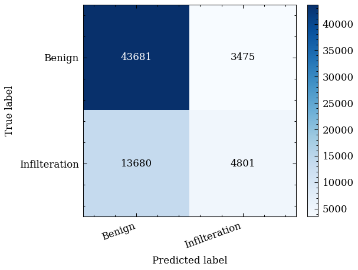

# 机器学习实践报告

**实践题目**：基于降维与分类的网络入侵检测系统  
**姓 名**：__________  
**学 号**：__________  
**院 系**：__________  
**专 业**：__________  
**指导教师**：__________  
**日期**：2026 年 1 月 2 日  

\pagebreak

## 摘要

网络入侵检测系统（Intrusion Detection System, IDS）在企业内网、数据中心与云边协同环境中承担着关键的安全监测职责。相较于传统基于签名或人工规则的检测方式，基于机器学习的 IDS 能够在一定程度上缓解规则维护成本高、对未知变种适应性弱的问题，但同时面临高维流量特征带来的计算开销、冗余相关性与“维度灾难”风险。为在检测性能与工程效率之间取得可操作的平衡，本文以 CSE-CIC-IDS2018 数据集的单日流量特征表（`Thursday-01-03-2018_TrafficForML_CICFlowMeter.csv`）为研究对象，基于 30 项核心流统计特征构建“降维 + 分类”的入侵检测建模流程，并在统一的清洗、归一化与分层划分口径下，对 PCA、LDA、t-SNE 三类降维方法与 SVM、随机森林、逻辑回归三类分类器进行组合对比评测。实验在清洗后 328,181 条样本上进行，采用 80%/20% 的训练/测试划分；考虑到网格搜索与 t-SNE 的计算复杂度，训练集进一步随机采样为 10,000 条以保证实验可在合理时间内完成。评估指标覆盖准确率、误报率（FPR）、漏报率（FNR）与训练/预测耗时，并对该单日数据中唯一的攻击类型（Infilteration）进行单独的精确率、召回率与 F1 评估。结果显示，PCA 在 10 维即可保留约 97% 信息，且在不同分类器下表现稳定，兼顾了信息保留与工程效率；t-SNE（2 维）+ SVM 虽取得最高整体准确率（76.05%）且误报率最低（1.03%），但对攻击样本的召回率较低，呈现显著的“低误报—高漏报”权衡。本文进一步结合二维可视化与混淆矩阵对误报/漏报机理进行解释，并给出面向实际部署的规则提取思路与改进方向。

**关键词**：入侵检测；CSE-CIC-IDS2018；降维；PCA；LDA；t-SNE；SVM；随机森林；逻辑回归

## ABSTRACT

Intrusion Detection Systems (IDS) play a critical role in monitoring enterprise networks and data centers. Compared with signature-based or manually maintained rule systems, machine-learning-based IDS can reduce rule maintenance costs and improve adaptability to unseen variants, but also suffers from high-dimensional traffic features, redundant correlations, and increased computational overhead. This work studies a “dimensionality reduction + classification” pipeline on a single-day subset of the CSE-CIC-IDS2018 dataset (`Thursday-01-03-2018_TrafficForML_CICFlowMeter.csv`). Using 30 core flow statistical features and a fixed cleaning/normalization protocol, we compare PCA, LDA, and t-SNE with three classifiers (SVM, Random Forest, and Logistic Regression). After cleaning, the dataset contains 328,181 samples with an 80/20 train/test split; the training set is further down-sampled to 10,000 samples to make grid search and t-SNE feasible within the course budget. We report Accuracy, False Positive Rate (FPR), False Negative Rate (FNR), and runtime (training and prediction), and additionally evaluate the only attack class in this day’s data (Infilteration) using Precision/Recall/F1. Results show that t-SNE (2D) + SVM achieves the highest accuracy (76.05%) and the lowest FPR (1.03%), but suffers from low attack recall, indicating a strong “low-false-alarm vs high-miss” trade-off. Random Forest is more stable across reducers and substantially faster at inference than SVM. We further provide visual explanations via 2D embeddings and confusion matrices, and discuss deployment-oriented security implications and improvement directions.

**Key words:** intrusion detection; CSE-CIC-IDS2018; dimensionality reduction; PCA; LDA; t-SNE; SVM; Random Forest; Logistic Regression

\pagebreak

## 目录

建议在导出 docx 时启用自动目录：`pandoc report.md -o report.docx --toc --toc-depth=3`。

\pagebreak

---

## 1 设计背景与要求

### 1.1 研究背景

网络空间威胁具有持续演进与强对抗性特征。攻击者常通过扫描探测、凭证窃取、横向移动、数据渗漏等多阶段链路实现目标，而真实业务网络同时承载多协议、多业务形态与高并发流量，导致安全监测必须在“覆盖广、响应快、误报可控”的约束下运行。传统 IDS（如基于特征字符串或固定规则的系统）对已知攻击有较高命中率，但当攻击载荷加密、行为轻量化或利用协议/业务特性进行变形时，固定规则往往难以及时更新；同时，规则越多越复杂，系统维护成本与误报风险也随之上升。由此，利用机器学习从历史流量中学习判别边界、以数据驱动方式识别异常模式成为重要研究方向。

然而，机器学习 IDS 并非“直接套用分类器”即可落地。流量特征往往具有维度高、尺度差异大、分布偏态与强相关性等特点，直接在原始高维空间训练模型会显著增加训练与推理成本，并可能因冗余噪声导致模型泛化能力下降。更关键的是，入侵检测的评价并不仅是“准确率越高越好”，而是与安全代价紧密耦合：误报过多会造成业务误拦截与运维疲劳，漏报过多则直接带来攻击逃逸与资产风险。因此，本课程实践在“算法对比 + 工程实现 + 安全性讨论”的综合要求下，选择以“降维 + 分类”的组合框架开展系统实验：通过降维压缩冗余特征、提高可分性与计算效率，再使用典型分类器完成检测决策，从而在可解释性与可复现性层面形成一套可交付的实践方案。

### 1.2 任务目标与指标口径

根据课程设计要求与项目约束，本实践需完成从数据集获取、预处理到模型训练、评估与报告交付的完整链路。本文将任务目标具体化为以下三类可验证结果：其一，形成可复现的数据清洗与预处理流程，明确保留/剔除特征与理由，并记录清洗前后样本量变化；其二，完成至少三类降维方法（PCA/LDA/t-SNE）的对比，并与三类分类器（SVM/随机森林/逻辑回归）组合形成不少于 9 组的评测结果；其三，在统一指标口径下给出结果分析与安全性评估，包含误报/漏报权衡、关键攻击类型检测能力、运行耗时与部署建议，并以规则文档的形式提炼可操作要点。

在指标口径方面，本文采用以下定义：准确率用于衡量整体预测一致性；误报率（False Positive Rate, FPR）刻画将正常流量误判为攻击的比例；漏报率（False Negative Rate, FNR）刻画将攻击流量误判为正常的比例。设二分类混淆矩阵元素分别为 TP、TN、FP、FN，则

$$\text{Accuracy}=\frac{TP+TN}{TP+TN+FP+FN},\quad \text{FPR}=\frac{FP}{FP+TN},\quad \text{FNR}=\frac{FN}{FN+TP}.$$

为反映工程可用性，本文同时记录分类器训练耗时与测试集预测耗时，并在分析部分将其换算为平均单样本预测时延以讨论实时检测可行性。需要强调的是，本实验基于单日数据实现二分类（Benign vs Infilteration），因此“重点攻击类型统计”对应 Infilteration 的精确率（Precision）、召回率（Recall）与 F1 分数；这既满足“针对高发攻击类型单独统计”的要求，也避免将与本日数据不匹配的攻击名称（如 DDoS）强行套入分析，从而保证报告口径与实验事实一致。

### 1.3 总体技术路线

本文的总体技术路线围绕“可复现、可比较、可解释”三条主线展开。首先，在数据层面采用固定的清洗规则（去除重复表头行、统一处理 Inf/-Inf/NaN、删除零时长零速率异常行），并在 30 项核心特征上进行 Min-Max 归一化，以减弱特征尺度差异对距离度量与优化过程的影响；其次，在建模层面分别构建 PCA、LDA 与 t-SNE 的降维表示，其中 PCA 与 LDA 作为可变换（transformable）的线性降维方法用于后续分类输入，t-SNE 作为非线性嵌入方法用于二维结构展示并参与组合对比；再次，在分类层面选取 SVM（RBF 核）、随机森林与逻辑回归，通过网格搜索与 3 折交叉验证优化超参数，并在同一测试集上报告准确率、误报率、漏报率与耗时；最后，在分析层面结合降维后的二维散点图、混淆矩阵与攻击类别单独指标，解释性能差异与误报/漏报来源，给出面向部署的改进方向与规则提取建议。

---

## 2 数据集说明与预处理

### 2.1 数据集来源与选取说明

实验数据来自加拿大通信安全局（CSE）与加拿大网络安全研究所（CIC）联合构建的 CSE-CIC-IDS2018 数据集 [1][2][3]。该数据集通过结构化场景生成与日志驱动的方式模拟真实网络环境，覆盖多类正常业务与攻击行为，并提供原始流量与由 CICFlowMeter 抽取的统计特征表 [4]。考虑到课程实践的时间预算与计算资源约束，同时为保证实验过程与结论可追溯，本文选用其中单日的“Processed Traffic Data for ML Algorithms”特征表：`Thursday-01-03-2018_TrafficForML_CICFlowMeter.csv`。该文件包含 80 列左右的流统计特征，标签列为 `Label`，其中 `Benign` 表示正常流量，`Infilteration` 表示攻击流量。

值得注意的是，实际工程中 IDS 通常需要处理多类攻击与多日流量的域偏移问题，而本次实践采用单日数据的主要目的是在可控计算量下完成降维与分类组合对比，聚焦方法论与评估口径的严谨性。由于单日数据仅包含一种攻击类型，本文将任务等价为二分类问题，并在“攻击类型检测分析”中针对 Infilteration 展开讨论。

### 2.2 特征工程：核心特征保留与剔除原则

为降低模型对拓扑强相关或易伪造字段的依赖，本文不使用源/目的 IP、端口、Flow ID 等字段，而固定保留 30 项核心流统计特征用于建模。该特征集合主要来自 CICFlowMeter 输出，偏向于流时长、前后向包数与字节数、包长分布统计量、到达间隔（IAT）统计量、速率特征与标志位计数等，能够从协议与业务无关的角度刻画流量行为。具体特征如下（以分号分隔）：Flow Duration; Tot Fwd Pkts; Tot Bwd Pkts; TotLen Fwd Pkts; TotLen Bwd Pkts; Fwd Pkt Len Max; Fwd Pkt Len Min; Fwd Pkt Len Mean; Fwd Pkt Len Std; Bwd Pkt Len Max; Bwd Pkt Len Min; Bwd Pkt Len Mean; Bwd Pkt Len Std; Flow Byts/s; Flow Pkts/s; Flow IAT Mean; Flow IAT Std; Flow IAT Max; Flow IAT Min; Fwd IAT Mean; Fwd IAT Std; Bwd IAT Mean; Bwd IAT Std; SYN Flag Cnt; ACK Flag Cnt; PSH Flag Cnt; FIN Flag Cnt; RST Flag Cnt; Active Mean; Idle Mean。

选择上述特征的理由在于：一方面，流统计特征对攻击行为具有较强的稳定性，例如扫描/渗透类攻击往往在包数、字节数、IAT 分布与标志位上与正常交互流量存在差异；另一方面，这些特征更接近“行为画像”，不依赖于特定网络拓扑与业务地址，因而在跨网络迁移时具有更好的泛化潜力。与此同时，固定特征集合也使降维与分类对比具有可复现性：不同实验组合仅改变降维器与分类器，而不在特征工程阶段引入额外变量。

### 2.3 清洗规则与样本量变化记录

原始 CSV 文件共 331,125 行，其中存在 25 行混入数据的重复表头（`Label` 列取值为字符串 `Label`）。按照项目固定清洗口径，本文依次执行以下操作：首先删除重复表头行；其次将特征列中的 `inf`/`-inf` 统一替换为 `NaN`，并对含 `NaN` 的样本行做删除处理，不采用数值填充；最后删除 `Flow Byts/s` 与 `Flow Pkts/s` 同时为 0 且 `Flow Duration` 为 0 的异常行，用以剔除无效的零流量记录。

清洗前后样本量变化如下：原始文件 331,125 行，去除重复表头后为 331,100 行；进一步处理 Inf/NaN 并删除异常零值行后，共保留 328,181 条样本。清洗后的类别分布为 Benign 235,778 条、Infilteration 92,403 条，正常流量占比约 71.84%，攻击流量占比约 28.16%。该比例说明数据存在一定不平衡但未达到极端稀缺的程度，为后续采用分层划分与宏平均指标（macro F1 作为网格搜索评分）提供了合理的统计基础。

为直观展示清洗后的类别分布，本文绘制了样本量柱状图，如下所示。该图一方面用于说明数据不平衡程度，另一方面也为后续“仅看准确率可能被多数类掩盖”的现象提供直观背景。

### 2.4 归一化、划分与训练采样策略

在清洗后的数据上，本文采用固定随机种子 42 进行 80%/20% 分层划分，得到训练集 262,544 条、测试集 65,637 条。由于 SVM 与随机森林的网格搜索需要在训练集上多次拟合模型，且 t-SNE 对样本规模极为敏感，为保证实验可在课程实践的时间预算内完成，本文在不改变测试集的前提下，对训练集进一步随机无放回采样为 10,000 条。采样后的训练集类别分布为 Benign 7,142 条、Infilteration 2,858 条，与总体分布基本一致，能够在一定程度上保留数据结构与类别差异。

特征归一化采用 Min-Max 归一化，将每个特征线性映射到 $[0,1]$ 区间。需要强调的是，归一化参数（每列的最小值与最大值）仅在训练集上拟合，并应用于测试集变换，以避免数据泄漏对评估造成偏乐观偏差。归一化的工程意义在于：一方面，距离度量与核函数（如 RBF 核）对尺度差异敏感，归一化可避免某些大尺度特征主导相似度；另一方面，降维方法（尤其是 PCA）在中心化与方差方向估计上也会受到尺度的影响，统一尺度更有利于主成分解释。

---

## 3 设计任务实现过程

### 3.1 工程实现与实验组织方式

本项目采用 Python 3.11 实现，并使用 `pixi.toml` 进行环境管理与依赖锁定，确保不同机器上复现时的版本一致性。代码按模块化方式组织在 `code/` 目录下：其中 `preprocess.py` 实现数据加载与清洗，`config.py` 固化特征列表、路径与随机种子，`torch_reducers.py` 提供基于 PyTorch 的 PCA 与 LDA 实现以便在具备 GPU 条件时加速矩阵计算，`torch_classifiers.py` 提供基于 PyTorch 的逻辑回归与简化网格搜索，`metrics.py` 实现准确率与误报/漏报计算，`plots.py` 统一配置 SciencePlots 的 IEEE 风格并输出二维散点图。主流程脚本 `code/run_experiments_torch.py` 将上述模块串联，输出三类结果文件：降维效果表（`data/processed/reduction_metrics.csv`）、组合性能表（`data/processed/metrics.csv`）与重点攻击类型指标表（`data/processed/attack_metrics.csv`），并在 `figures/` 下生成对应的可视化图表。

为了使不同组合结果具有可比性，主流程遵循统一的数据划分与归一化策略，并对每一种降维设置缓存降维后的训练/测试表示，避免对相同降维器重复计算。实验组合遵循“5 组降维配置 × 3 类分类器”的设计，共计 15 组。虽然课程要求至少 9 组组合，本项目在此基础上加入 LDA 与 t-SNE 的对比，使结果更完整，且便于在报告中讨论线性/非线性降维的差异。

为便于读者从系统角度理解整体流水线，本文将“数据 → 预处理 → 降维 → 分类 → 评估与可视化”的实现过程抽象为流程图，如下所示。该图与 `code/run_experiments_torch.py` 的执行顺序一一对应，可作为复现与答辩说明的纲要。

### 3.2 降维方法：原理、实现与参数设置

#### 3.2.1 PCA（主成分分析）

PCA 是典型的无监督线性降维方法，其思想是在保留样本总体方差尽可能大的前提下，寻找一组正交基向量将高维数据投影到低维子空间 [5]。设中心化后的数据矩阵为 $X\in\mathbb{R}^{n\times d}$，PCA 通过对 $X$ 的奇异值分解（SVD）或对协方差矩阵的特征分解得到主成分方向，并选择前 $k$ 个方向构成投影矩阵 $W\in\mathbb{R}^{k\times d}$，从而得到低维表示 $Z=XW^T$。在工程实现上，本项目使用 PyTorch 的 `torch.linalg.svd` 计算 SVD，并据此计算解释方差比（explained variance ratio），用其累积和作为信息保留率的度量。实验分别取 $k=10,15,20$，以覆盖“较强压缩”“折中压缩”“轻度压缩”三种典型场景，并观察信息保留率与分类性能随维度变化的趋势。

#### 3.2.2 LDA（线性判别分析）

LDA 属于有监督线性降维方法，其目标是在投影后最大化类间散度、最小化类内散度，从而增强类别可分性 [6]。设总体均值为 $\mu$，第 $c$ 类均值为 $\mu_c$，类内散度矩阵为 $S_W$，类间散度矩阵为 $S_B$，则 LDA 通过求解广义特征值问题 $S_B w = \lambda S_W w$ 得到判别方向；本实验为二分类设置，因此输出 1 维判别表示。本项目的实现以 PyTorch 计算散度矩阵并求解特征分解，在数值不稳定时回退到 scikit-learn 的实现以保证鲁棒性。

#### 3.2.3 t-SNE（t-分布随机邻域嵌入）

t-SNE 是典型的非线性降维与可视化方法，通过在高维空间与低维空间分别定义相似度分布，并最小化二者的 KL 散度，使低维嵌入尽可能保持局部邻域结构 [7]。在高维空间中，t-SNE 将样本对的相似度定义为高斯分布条件概率；在低维空间中，为缓解“拥挤问题”，使用自由度为 1 的 Student t 分布定义相似度，并通过梯度下降优化嵌入坐标。由于 t-SNE 不具备显式的线性变换形式，且其结果对超参数与初始化较为敏感，本文将其主要用于二维可视化，并将 2 维嵌入作为一种对比性的“降维表示”参与组合评测，以观察非线性嵌入在该数据上的判别潜力。

按照项目固定口径，t-SNE 参数设置为 `perplexity=30`、`learning_rate='auto'`、`init='pca'`、`n_iter=1000`、`random_state=42`。需要特别强调：t-SNE 在严格意义上属于转导式（transductive）方法，难以对未见样本进行一致的 `transform`；因此其作为“降维 + 分类”流水线在部署时存在天然限制。本文在报告的安全性与工程性讨论中将对此给出明确说明，并将 PCA/LDA 作为更可落地的降维方案。

### 3.3 分类器：模型选择、网格搜索与指标计算

#### 3.3.1 SVM（支持向量机）

SVM 通过构造最大间隔超平面实现分类，在小样本与非线性可分场景中具有良好泛化能力 [8]。对于非线性问题，SVM 通过核函数 $K(x_i,x_j)$ 实现隐式映射，本文采用 RBF 核 $K(x_i,x_j)=\exp(-\gamma\lVert x_i-x_j\rVert^2)$。SVM 的关键超参数包括惩罚系数 $C$ 与核宽度参数 $\gamma$，分别控制间隔与误差的权衡以及决策边界的复杂度。为兼顾网格搜索有效性与实验效率，本文使用优化后的参数网格：$C\in\{1,10\}$，`kernel='rbf'`，`gamma='scale'`，采用 3 折交叉验证并以 `f1_macro` 作为评分标准。

#### 3.3.2 随机森林

随机森林通过对训练数据进行 Bootstrap 采样并在节点分裂时随机选择特征子集构建多棵决策树，最终通过投票得到预测结果 [9]。其优势在于对非线性关系与特征交互具有较强建模能力，并且对噪声与异常值相对鲁棒。本文将随机森林作为工程上更常见的基线模型之一，并采用简化网格：`n_estimators=200`，`max_depth∈{None,20}`，`min_samples_split=2`，同样用 3 折交叉验证与 `f1_macro` 评分选择超参数。

#### 3.3.3 逻辑回归

逻辑回归是经典的线性分类模型，可解释性强且训练高效 [10]。本文使用 PyTorch 实现多类别 softmax 形式的逻辑回归，并以交叉熵损失进行优化，同时加入 $L_2$ 正则化项以控制模型复杂度。超参数主要为正则强度 $C$（与正则系数成倒数关系），网格设为 $C\in\{0.1,1,10\}$，`max_iter=1000`，并以 3 折交叉验证的宏平均 F1 选择最优参数。逻辑回归在本实验中主要承担“线性可分性基线”的角色：若其性能接近非线性模型，则说明降维后特征空间具有较强线性判别结构；反之，则说明该数据的边界更可能依赖非线性特征交互。

#### 3.3.4 评估指标与耗时统计

本文对每组组合在测试集上计算准确率、误报率与漏报率，并记录分类器训练耗时与测试集预测耗时。耗时统计采用墙钟时间（wall-clock time），训练耗时包含网格搜索与交叉验证拟合过程，预测耗时为对完整测试集（65,637 条）一次性推理的总时间。由于不同模型的实现路径不同（SVM/随机森林采用 scikit-learn，逻辑回归采用 PyTorch），耗时结果更多反映该实验环境下的相对量级，用于辅助讨论“模型复杂度与实时性”的工程权衡，而不作为跨平台绝对性能的评价。

---

## 4 算法对比与结果分析

### 4.1 降维效果对比：信息保留与类间分离

降维方法的评价不应仅依赖后续分类准确率，因为分类器本身也会引入偏差。为更细致地理解“降维是否保留了对检测有用的结构”，本文从两个角度对降维效果进行量化：其一是信息保留率（Information retention），对 PCA/LDA 以解释方差比的累积和近似衡量；其二是类间分离度（Class separation），本文定义为训练集低维表示中“类间散度 / 类内散度”的比值，即

$$\text{Sep} = \frac{\sum_c n_c\lVert \mu_c-\mu\rVert^2}{\sum_c\sum_{x\in c}\lVert x-\mu_c\rVert^2},$$

其中 $\mu$ 为总体均值，$\mu_c$ 为第 $c$ 类均值，$n_c$ 为该类样本数。该指标并不等价于 Fisher 判别准则，但能够从几何角度反映两类在低维空间中的相对可分性，便于横向比较不同降维方法在“拉开类间距离、压紧类内分布”方面的效果。

实验结果（详见 `results.md` 第 2 节表格）显示：PCA 在 10 维时信息保留率已达 0.9728，15 维与 20 维分别达到 0.9938 与 0.9986，说明所选 30 维核心特征存在较强冗余相关性，线性子空间能够在较低维度下保留绝大多数方差结构。与之相对，LDA 在二分类下只能输出 1 维判别表示，但其类间分离度（0.0189）显著高于 PCA（约 0.0064～0.0065），这与 LDA 使用标签信息直接优化类别可分性的理论预期一致。t-SNE 的“信息保留率”不适用解释方差口径，项目实现中将其置为 0 以提示不可比；在类间分离度指标上，t-SNE（0.0149）介于 LDA 与 PCA 之间，表明非线性嵌入在局部结构保持方面具有一定优势，但其分离度提升并不必然转化为更高的攻击召回率，仍需结合后续分类与误报/漏报分析综合判断。

为直观呈现 PCA 在不同维度下的信息保留趋势，本文补充绘制了信息保留率随主成分数变化的折线图，如图所示。该图进一步说明：在 30 维核心特征上，前 10 个主成分已解释绝大多数方差，继续增加维度的边际收益快速降低，因此在工程上可优先选择 10 维作为计算与信息保留的折中点。

### 4.2 组合性能对比：准确率、误报/漏报与耗时

在统一的训练/测试划分与超参数网格下，本文完成 15 组“降维×分类”组合评测，完整结果见 `results.md` 第 3 节表格。总体上可以观察到三条规律。

第一，从工程可用性与稳定性角度看，PCA 作为主线降维方法更符合“可复现、可解释、可部署”的课程目标。PCA 在 10/15/20 维下的信息保留率均超过 97%，且各分类器在 PCA 表示上的准确率与误报/漏报波动相对可控，便于形成可追溯的对比结论。

第二，随机森林在不同降维设置下表现更为稳定。以 PCA 为例，PCA-10D + 随机森林准确率达到 75.39%，PCA-15D 与 PCA-20D 分别为 74.91% 与 74.82%，差异很小；在 LDA 与 t-SNE 下，随机森林也维持在 73.91%～74.91% 区间。更重要的是，随机森林的预测耗时在本实验环境下约为 0.76～0.84 秒/65,637 样本，折算为约 $0.012\,\text{ms/样本}$ 的量级，显著低于 SVM 的约 8.2～8.9 秒（约 $0.13\,\text{ms/样本}$）。在需要高吞吐实时检测的场景中，这一推理差异具有直接工程意义。

第三，若仅以整体准确率排序，最高的组合为 t-SNE（2 维）+ SVM，测试集准确率为 76.05%。然而该组合同时具有极低误报率（1.03%）与极高漏报率（82.45%），这意味着模型几乎不会将正常流量误判为攻击，但会漏掉绝大多数攻击样本。在 IDS 场景中，这类模型更接近“保守告警器”：一旦告警可信度较高，但无法承担单独拦截的职责，需要与高召回率的检测层（如基于规则或异常检测）协同。t-SNE 在本文中更多承担二维可视化与结构对照的角色，用于解释“低误报—高漏报”的成因，而非作为主部署方案。

从维度选择角度看，PCA 的 10/15/20 维在平均准确率上差异不大（分别约 0.7388、0.7378、0.7371），说明当信息保留率已超过 97% 时，进一步增加维度对分类性能的边际收益有限；在工程部署中更可以倾向于 10 维以降低计算开销与存储成本。该结论与“在信息保留与检测耗时之间寻找折中点”的实践目标一致。

为便于整体比较 15 组组合的准确率水平，本文将各组合按准确率排序并绘制柱状图；同时，为展示误报与漏报之间的权衡关系，绘制了以 FPR 为横轴、FNR 为纵轴的散点图，并用不同颜色区分分类器类别。两幅图与表格结果一致，能够更直观地反映“某些组合准确率相近但误报/漏报结构差异显著”的现象。

### 4.3 重点攻击类型（Infilteration）检测能力分析

为回应“需单独统计高发攻击类型检测精度”的要求，本文对最优组合（t-SNE + SVM）的攻击类 Infilteration 单独计算精确率、召回率与 F1 分数。结果显示：Infilteration 的 Precision 为 0.8699，Recall 为 0.1755，F1 为 0.2920（详见 `results.md` 第 4 节表格）。该结果与整体 FPR/FNR 的结构一致：模型将“少量判为攻击的样本”判得较准（高精确率），但对攻击总体覆盖不足（低召回率）。

从安全性角度解释，这种高精确率/低召回率的模型在落地时可承担“高置信告警通道”或“二次复核触发器”的角色。例如在 SOC 运维中，可将其输出作为高优先级告警进入人工分析队列，或者用于触发更昂贵但更敏感的深度检测模块（如基于 DPI 的策略、基于会话重放的沙箱分析等）。相反，若将其作为唯一的拦截决策依据，则由于漏报率过高，会造成大量攻击流量绕过，风险不可接受。

因此，在课程实践的“安全性评估”维度，本文不将“最优准确率”直接等价为“最优安全性”，而强调需结合 FPR 与 FNR 的业务代价进行模型选择：对误报极其敏感、且已有其他高召回防线的环境，低误报模型具有价值；对高风险业务或攻击后果严重的环境，应优先追求召回率并通过多策略融合控制误报。

### 4.4 可视化与误差来源解释

为直观理解降维后的类别结构，本文对 PCA 与 t-SNE 输出二维散点图并存储于 `figures/` 目录。PCA 在 10/15/20 维的二维投影图分别见 `figures/PCA_10_2d.png`、`figures/PCA_15_2d.png` 与 `figures/PCA_20_2d.png`；t-SNE 的二维嵌入见 `figures/t-SNE_2_2d.png`。从整体观察，PCA 的二维投影呈现出两类样本在局部区域存在混叠的现象，这与 PCA 以总体方差最大化为目标而非类别可分性优化有关；尽管 10 维已保留 97% 以上方差，但“对分类有用的信息”并不完全等价于“总体方差”，因此仍需要分类器在低维空间学习非线性边界。

t-SNE 的二维嵌入在局部结构呈现上更为清晰，部分攻击样本形成相对独立的簇或分布带状结构，这解释了 t-SNE + SVM 组合能够将一部分攻击样本高置信地区分出来，从而获得极低的误报率与较高的攻击精确率。与此同时，t-SNE 嵌入中仍存在攻击样本与正常样本的交叠区域，使得大部分攻击样本落入正常流量主簇附近，从而导致召回率偏低、漏报率偏高。

除散点图外，本文补充生成了多组混淆矩阵图以更直接展示误报与漏报的数量级，避免仅用比例指标造成直觉偏差。具体包括：PCA-10D + 随机森林（`figures/ConfusionMatrix_PCA10_RandomForest.png`）、PCA-10D + SVM（`figures/ConfusionMatrix_PCA10_SVM.png`）以及 LDA-1D + 随机森林（`figures/ConfusionMatrix_LDA1_RandomForest.png`）。结合这些图可以观察到：不同组合在整体准确率相近时，仍可能在攻击类的漏检规模上差异显著，从而导致安全代价完全不同。

在实时性方面，本文进一步将测试集总预测耗时换算为平均单样本预测时延并绘制柱状图，用于比较不同组合在吞吐需求下的可部署性。总体上，随机森林组合的推理时延显著低于 SVM，这与其在表格中的预测时间结果一致。

### 4.5 综合讨论：工程可用性与方法局限

从工程部署角度，本实验结果提示“可用性”主要受三类因素影响：一是降维方法是否支持对新样本的稳定变换；二是分类器推理时延能否满足链路吞吐；三是误报与漏报能否在业务代价约束下达到可接受区间。PCA 与 LDA 属于显式变换，能够对流式数据进行在线变换，因此具备更直接的落地潜力；t-SNE 虽能提供良好的可视化解释，但其转导式属性与对样本规模的敏感性使其更适合作为离线分析工具，而非在线检测前端。

此外，本实验为保证可复现性与计算效率，对训练集进行了 10,000 条采样。该采样策略降低了网格搜索的成本，但也可能削弱模型对少数模式的学习能力，从而影响攻击召回率。尤其对 SVM 而言，支持向量的数量与分布会影响决策边界形态，采样可能导致边界过于保守；对逻辑回归而言，若在采样训练中多数类占优且未使用类权重，模型可能倾向于输出多数类，从而出现“全预测正常”的退化情形。以上局限并不否定实验结论的比较价值，但提示后续应在更大训练规模与更完善的不平衡处理策略下验证性能是否可提升。

最后，还需指出 t-SNE 在本项目实现中为生成一致的训练/测试嵌入，将训练与测试数据拼接后共同拟合嵌入再切分，这在严格意义上会引入一定的数据泄漏（测试分布参与了嵌入构造），从而可能使评估偏乐观。由于 t-SNE 主要用于可视化，且难以对测试集进行独立变换，本文在结果解读中将其定位为“离线分析参考”，并建议在部署时以 PCA/LDA 等可变换方法为主，或采用能够学习显式映射的非线性降维方法（如自编码器）替代。

### 4.6 安全性能分析

根据《机器学习实践》课程设计通用说明，网络安全类题目需在结果分析中增加“安全性能分析”小节。本实践将安全性能分析聚焦于 IDS 在真实部署中最关键的两类风险：误报导致的业务代价与漏报导致的安全代价。误报（FPR）过高会使大量正常连接被误判为攻击，轻则造成告警洪泛与运维疲劳，重则引发业务误拦截与用户体验损失；漏报（FNR）过高则意味着攻击流量在检测系统前端被视为正常，从而可能绕过防护、触发后续资产入侵与横向移动等连锁后果。因此，模型选择不应只看准确率，而应结合业务对误报与漏报的容忍度进行代价权衡。

从本次实验结果看，t-SNE（2 维）+ SVM 组合具有最低误报率（1.03%），在“告警需高可信、不能频繁打扰业务”的场景中具备价值，但其漏报率较高，意味着不能单独作为拦截决策层。相对而言，随机森林在多个降维设置下表现更稳健，且推理时延更低，更适合作为高吞吐的在线筛查组件；在需要进一步降低漏报时，可考虑引入类权重、代价敏感学习或阈值重设，将“漏报优先”的安全策略显式纳入优化目标。此外，由于本次仅使用单日数据进行二分类评测，模型对跨天域偏移与多攻击类型的鲁棒性仍需在更大范围数据上验证。

在对抗性层面，入侵检测属于强对抗场景，攻击者可能通过调整流量行为使统计特征更接近正常分布。为降低“可伪造特征”对模型的影响，本实践固定剔除了源/目的 IP、端口等拓扑强相关字段，仅使用与流行为统计相关的 30 项核心特征，但这并不意味着特征无法被攻击者影响。更稳健的工程方案通常需要“多层检测”与“证据融合”：一方面保留基于规则/签名的高召回层用于覆盖典型攻击模式，另一方面使用机器学习模型提供更强的泛化检测能力，并对高置信告警触发二次复核。相应的规则提取与部署建议已在 `rules.md` 中给出，便于将模型输出转化为可落地的检测流程。

---

## 5 总结与改进方向

### 5.1 总结

本文围绕“基于降维与分类的网络入侵检测系统”课程实践目标，完成了从数据清洗、特征工程、降维对比到分类组合评测与安全性分析的完整流程。在 CSE-CIC-IDS2018 单日数据（Benign vs Infilteration）的实验中，PCA 在 10 维即可保留约 97% 的方差信息，说明所选 30 项核心流统计特征存在明显冗余，线性降维能够在较低维度下实现有效压缩；LDA 在二分类下输出 1 维表示，但类间分离度显著高于 PCA，体现了监督信息对判别结构增强的作用。总体上，PCA 作为主线方案在信息保留、可解释性与可部署性之间形成了更稳妥的折中；t-SNE 主要用于可视化与结构对照，虽在局部组合上准确率较高，但在攻击召回率上存在明显权衡；随机森林在各降维设置下表现稳健且推理速度优势突出，适合作为工程基线或与其他检测层协同的候选模型。上述结论在统一清洗口径、固定特征集合与统一评估指标下得到，具有清晰的可追溯性与可复现性。

### 5.2 改进方向

在后续工作中，本文认为可以从“数据、模型、决策与系统”四个层面推进改进。首先在数据层面，可在保持单日可控计算量的前提下引入更多天的数据进行训练与跨日测试，以评估域偏移下的鲁棒性，并通过更精细的采样策略（分层采样、时间窗采样、难例挖掘）提升对攻击边界样本的覆盖；其次在模型层面，可加入类别权重（`class_weight`）、代价敏感学习或重采样（如 SMOTE/欠采样）以降低漏报，并尝试更适合高维表格数据的梯度提升树（如 XGBoost/LightGBM）或显式映射的非线性降维（自编码器、监督对比学习嵌入）以替代 t-SNE 的转导式限制；再次在决策层面，应避免以 0.5 固定阈值直接输出二值结果，而应根据业务代价选择阈值、引入校准与置信度分层，并在告警链路中显式区分“高置信攻击”“可疑需复核”“高置信正常”三类状态以缓解误报与漏报的结构性矛盾；最后在系统层面，可构建多层检测架构，将低误报模型作为精确告警通道，将高召回模型作为广覆盖筛查通道，并配合规则引擎与日志关联分析实现闭环。

综上，降维与分类的组合框架能够在网络入侵检测中提供清晰的工程路径与可解释分析视角，但要达到可部署、可迭代的实用系统，还需要在数据覆盖、代价建模、阈值策略与多模型融合上进一步完善。

---

## 6 实训体会

本次实践的最大收获在于将课堂中“算法原理”的知识链条完整落地到“可复现实验系统”的工程链条。以入侵检测为例，数据清洗并不是简单的缺失值处理：原始 CSV 中混入的重复表头行会直接破坏数值特征解析；`inf/-inf` 与极端异常行会在归一化与距离度量中产生连锁放大效应；若清洗口径不固定，后续对比结果将缺乏可追溯性。通过将清洗规则固化到 `code/preprocess.py` 并在报告中记录样本量变化，本实践对“实验结论必须可复现、可解释”有了更直观的理解。

此外，本次实践也暴露出机器学习工程中常见的时间预算问题。以 SVM 网格搜索为例，若在大规模训练集上直接进行多折交叉验证，运行时间会呈倍数增长并迅速超出课程实践可承受范围。通过在保证测试集全量评测的前提下对训练集进行固定随机采样，并采用代表性的参数网格，本实践在“满足调参要求”与“保证可完成性”之间取得了可接受的折中。这一过程也提示：在实际项目中，应优先用小规模数据验证流程与估算时间，再逐步扩大规模，避免在实验后期因计算瓶颈导致整体交付风险。

最后，在指标理解方面，本次结果提醒我不能将“准确率”视为 IDS 的唯一目标。逻辑回归在测试集上出现“误报率为 0、漏报率为 1”的退化现象，表面准确率却仍处于 71% 左右，说明在类别不平衡场景中单一指标会误导决策。将 FPR/FNR、混淆矩阵与攻击类 Precision/Recall/F1 纳入分析后，才能真正对模型的安全价值做出判断。后续若有时间，我希望进一步尝试代价敏感学习、阈值调优与多模型融合，以更贴近真实安全场景的需求。

---

## 参考文献

[1] CSE-CIC-IDS2018 on AWS. Available: https://registry.opendata.aws/cse-cic-ids2018/

[2] Canadian Institute for Cybersecurity. CIC-IDS2018 Dataset. Available: https://www.unb.ca/cic/datasets/ids-2018.html

[3] I. Sharafaldin, A. H. Lashkari, and A. A. Ghorbani, “Toward Generating a New Intrusion Detection Dataset and Intrusion Traffic Characterization,” in *Proceedings of the 4th International Conference on Information Systems Security and Privacy (ICISSP)*, 2018.

[4] Canadian Institute for Cybersecurity. CICFlowMeter. Available: https://www.unb.ca/cic/research/applications.html#CICFlowMeter

[5] I. T. Jolliffe, *Principal Component Analysis*, 2nd ed. New York: Springer, 2002.

[6] R. A. Fisher, “The Use of Multiple Measurements in Taxonomic Problems,” *Annals of Eugenics*, vol. 7, no. 2, pp. 179–188, 1936.

[7] L. van der Maaten and G. Hinton, “Visualizing Data using t-SNE,” *Journal of Machine Learning Research*, vol. 9, pp. 2579–2605, 2008.

[8] C. Cortes and V. Vapnik, “Support-Vector Networks,” *Machine Learning*, vol. 20, no. 3, pp. 273–297, 1995.

[9] L. Breiman, “Random Forests,” *Machine Learning*, vol. 45, no. 1, pp. 5–32, 2001.

[10] D. W. Hosmer, S. Lemeshow, and R. X. Sturdivant, *Applied Logistic Regression*, 3rd ed. Hoboken, NJ: Wiley, 2013.

---

## 附录

附录材料以独立 Markdown 文档形式提供，便于在 `pandoc` 转换到 docx 时进行拆分与排版：实验结果汇总表见 `results.md`，入侵检测规则与安全要点提取见 `rules.md`，代码运行与数据准备说明见 `README.md`。此外，本次实验生成的主要图表位于 `figures/` 目录，可在正文分析中按需插入并配图说明。

\pagebreak

### 附录 A：图表清单

本报告引用图表均位于 `figures/` 目录，主要包括：清洗后类别分布图、PCA 信息保留率图、组合准确率对比图、FPR-FNR 权衡图、预测时延对比图、二维散点图以及多组混淆矩阵图。若需重新生成图表，可运行 `pixi run python code/plot_results.py` 与 `pixi run python code/generate_confusion_matrices.py`。

\pagebreak

### 附录 B：代码与数据索引

代码目录为 `code/`，其中主实验脚本为 `code/run_experiments_torch.py`；预处理脚本为 `code/preprocess.py`；降维与分类模块分别为 `code/torch_reducers.py` 与 `code/torch_classifiers.py`。预处理后的结果表位于 `data/processed/`，包括 `metrics.csv`、`reduction_metrics.csv` 与 `attack_metrics.csv`。这些产物与报告中的表格与图表一一对应，便于追溯与复现。
