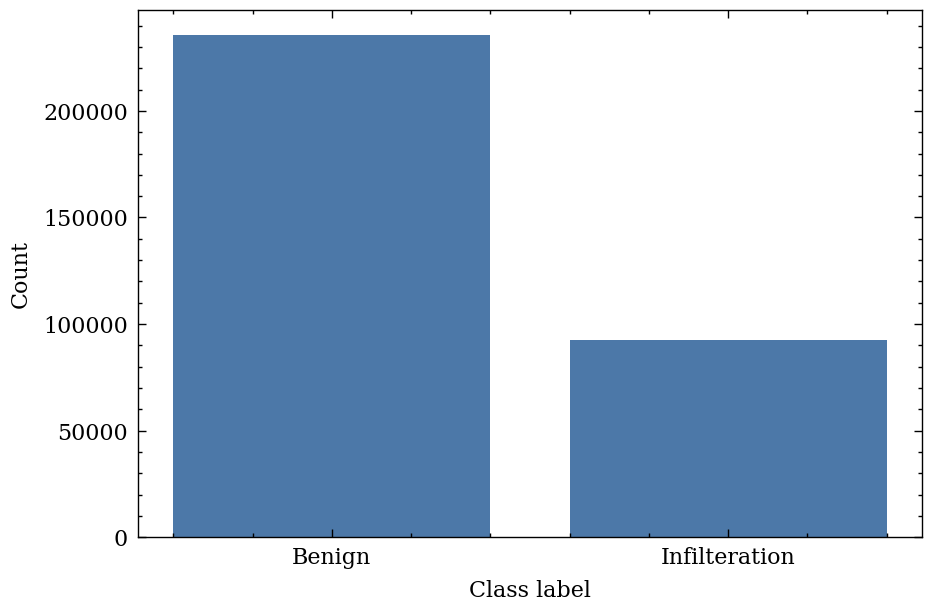
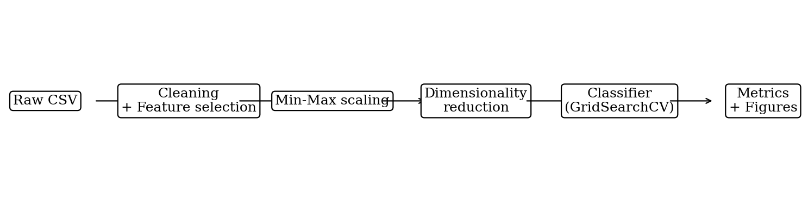
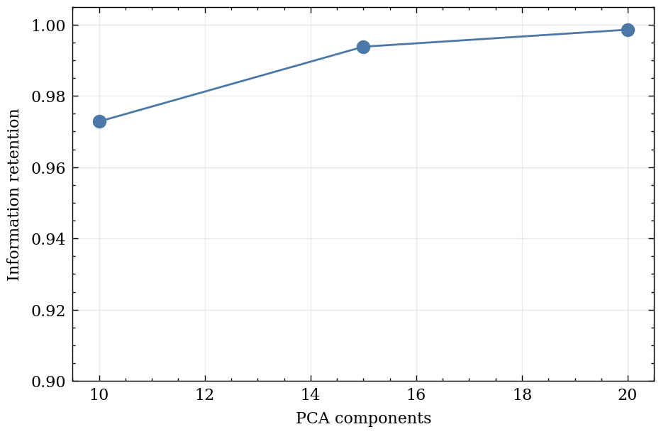
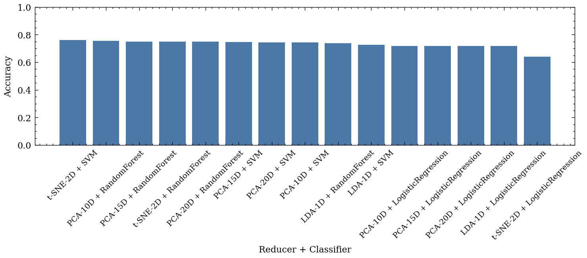
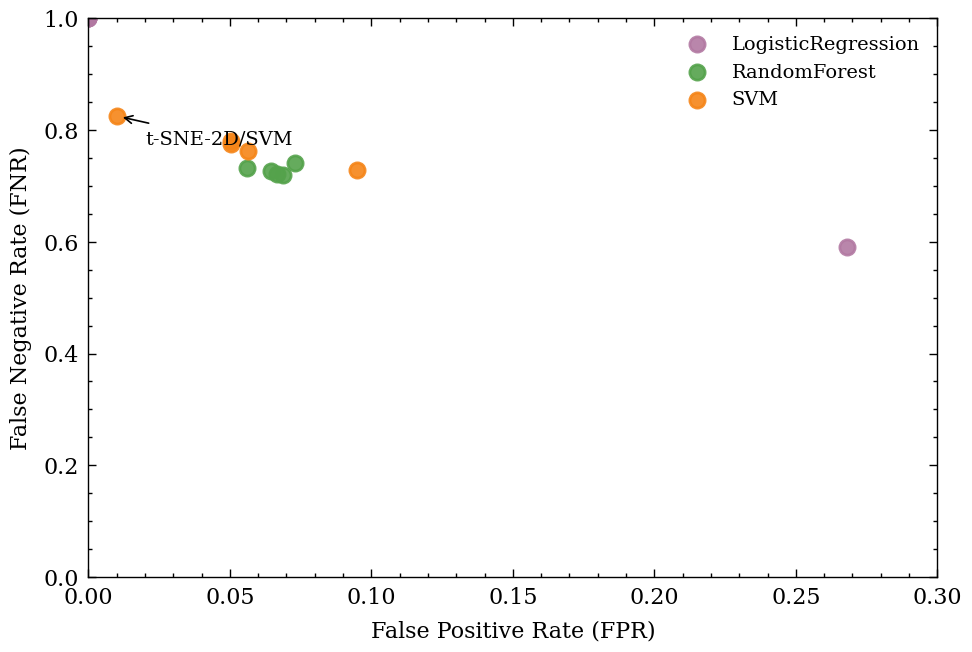
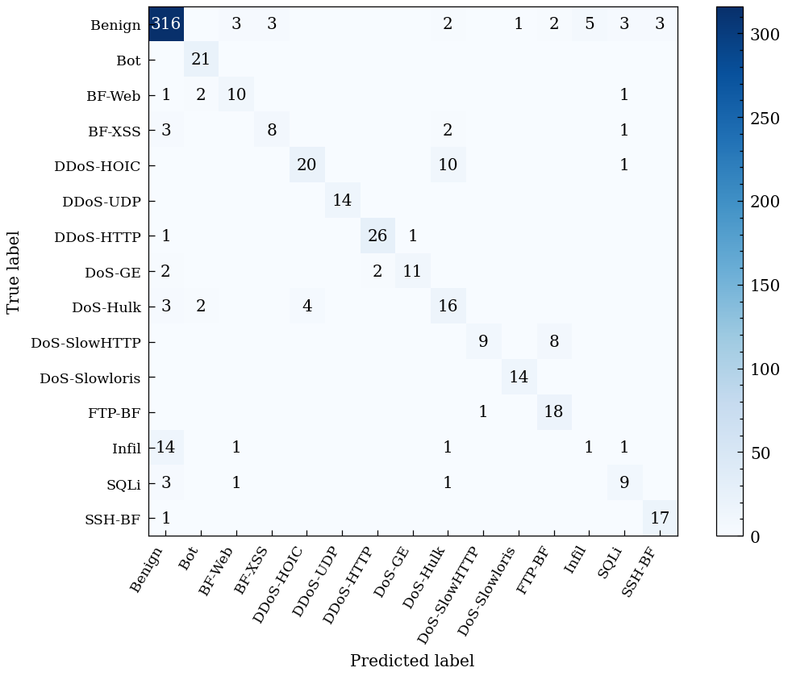
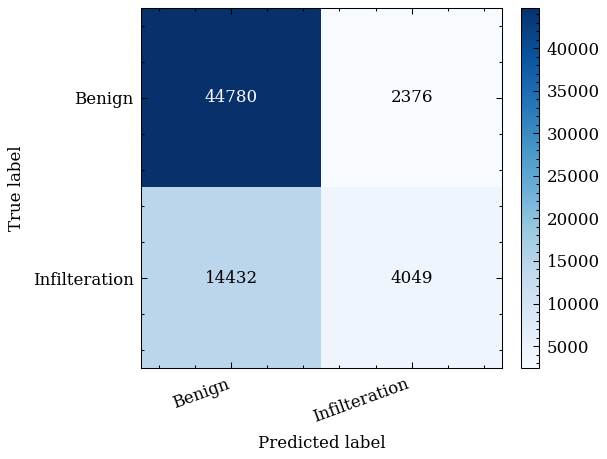
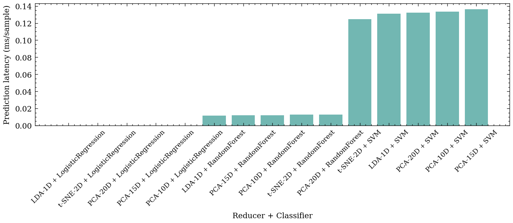

# 机器学习实践报告

## 摘要

网络入侵检测在高吞吐、低时延的业务网络中需要同时兼顾检测效果与工程开销。针对流量统计特征维度高、相关性强、训练与推理成本较高的问题，本文基于 CSE-CIC-IDS2018 数据集的特征表构建多类别检测任务，选取 30 项核心流统计特征，在统一清洗、归一化与分层划分条件下，比较 PCA 与 LDA 两类降维方法与 SVM、随机森林、逻辑回归三类分类器的组合性能；t-SNE 仅用于二维可视化以辅助结构观察。评价指标包括准确率、误报率（FPR）、漏报率（FNR）以及训练与预测耗时，并对各攻击类型给出 Precision、Recall 与 F1。实验结果表明，PCA 在较低维度下即可保留主要方差信息，而 LDA 在类别分离方面更具优势；综合误报、漏报与实时性表现，LDA-10D 与随机森林的组合取得相对最优的整体效果。基于上述结果，本文进一步结合可视化与混淆矩阵分析误差来源，并讨论面向实际部署的安全性影响与改进方向。

**关键词**：入侵检测；CSE-CIC-IDS2018；降维；PCA；LDA；t-SNE；SVM；随机森林；逻辑回归

## ABSTRACT

Intrusion detection in high-throughput production networks requires a practical balance between detection quality and computational cost. To address the high dimensionality and strong redundancy of flow-based statistical features, this study formulates a multi-class intrusion detection task on the CSE-CIC-IDS2018 feature dataset. Using 30 selected core flow features and a fixed protocol for data cleaning, normalization, and stratified splitting, we evaluate combinations of two dimensionality reduction methods (PCA and LDA) and three classifiers (SVM, Random Forest, and Logistic Regression). t-SNE is used only for 2D visualization to aid structural inspection. We report Accuracy, False Positive Rate (FPR), False Negative Rate (FNR), as well as training and inference time, and provide per-attack Precision, Recall, and F1 scores. The results indicate that PCA preserves most of the variance with a small number of components, while LDA offers stronger class separation. Considering error trade-offs and efficiency, the LDA-10D plus Random Forest configuration achieves the most favorable overall performance. We further analyze error patterns via visualization and confusion matrices and discuss security implications and potential improvements for deployment.

**Key words:** intrusion detection; CSE-CIC-IDS2018; dimensionality reduction; PCA; LDA; t-SNE; SVM; Random Forest; Logistic Regression

\pagebreak

## 目录

建议在导出 docx 时启用自动目录：`pandoc report.md -o report.docx --toc --toc-depth=3`。

\pagebreak

---

## 1 设计背景与要求

### 1.1 研究背景

入侵检测系统需要在高吞吐的业务网络中持续识别异常行为，其有效性不仅取决于检测率，还受误报与漏报的安全代价约束。基于规则或签名的检测方法在已知模式下具有较强确定性，但面对攻击载荷加密、行为变形与攻击链条多阶段化等趋势时，规则更新与维护成本显著上升，且难以覆盖未知变种。基于机器学习的检测方法能够利用历史流量特征学习判别边界，为多攻击类型识别提供了更具扩展性的建模途径。

在工程层面，流量统计特征通常维度较高且存在冗余相关性，直接在原始特征空间训练模型会带来较高的训练与推理开销，并可能因噪声与相关性导致泛化不稳。另一方面，入侵检测的实际决策往往需要在实时性与检测性能之间取得平衡：更复杂的模型未必带来等比例的收益，却可能显著增加延迟与资源占用。基于此，本文采用“降维 + 分类”的组合框架，通过降维压缩冗余信息并改善表示结构，再在低维表示上训练分类器，以对比不同方法在性能与效率上的权衡关系。

### 1.2 任务目标与指标口径

本文的研究目标是构建一套可复现实验流程，并在统一数据处理与评价口径下完成“降维方法—分类器”组合对比。具体而言：首先，建立稳定的数据清洗与预处理流程，在固定特征集合下完成归一化与训练/测试划分，保证后续结果具有可追溯性；其次，对 PCA、LDA 与 t-SNE 三类降维方法进行对比，其中 t-SNE 主要用于二维结构展示；再次，结合 SVM、随机森林与逻辑回归三类分类器开展组合评测，形成不少于 9 组的“降维×分类”对比结果；最后，在结果分析中讨论误报与漏报的来源及其安全含义，并对高发攻击类型给出单独的检测指标。

在指标口径方面，本文采用以下定义：准确率用于衡量整体预测一致性；误报率（False Positive Rate, FPR）刻画将正常流量误判为攻击的比例；漏报率（False Negative Rate, FNR）刻画将攻击流量误判为正常的比例。由于本实验为多类别设置，FPR/FNR 采用“Benign vs Attack”的二值化口径计算，设二分类混淆矩阵元素为 TP、TN、FP、FN，则

$$\\text{Accuracy}=\\frac{TP+TN}{TP+TN+FP+FN},\\quad \\text{FPR}=\\frac{FP}{FP+TN},\\quad \\text{FNR}=\\frac{FN}{FN+TP}.$$

为反映工程可用性，本文同时记录训练耗时与测试集预测耗时，并在分析中换算为平均单样本预测时延，以评估不同组合的实时检测潜力。针对攻击类型层面的差异，本文对各攻击类别报告 Precision、Recall 与 F1，并在结果讨论中重点关注样本量较高的攻击类型及其误差模式。

### 1.3 总体技术路线

本文整体流程由数据预处理、降维表示学习、分类建模与综合评估四部分组成。预处理阶段对原始特征表进行清洗并剔除异常记录，在固定特征集合上进行 Min-Max 归一化，并采用分层策略划分训练集与测试集，以减少数据泄漏与类别不平衡带来的偏差。随后，分别利用 PCA 与 LDA 生成低维表示作为分类输入，并以 t-SNE 的二维嵌入辅助观察类别结构。分类阶段选取 SVM、随机森林与逻辑回归作为代表性模型，通过网格搜索与交叉验证确定超参数，并在同一测试集上统一报告检测性能与耗时指标。最后，结合二维可视化、混淆矩阵与按攻击类型统计的指标，对误报与漏报的成因进行解释，并据此讨论面向部署的安全性影响与改进方向。

---

## 2 数据集说明与预处理

### 2.1 数据集来源与选取说明

实验数据来自加拿大通信安全局（CSE）与加拿大网络安全研究所（CIC）发布的 CSE-CIC-IDS2018 数据集 [1][2][3]。该数据集在受控网络环境中生成多类正常业务与攻击行为，并提供由 CICFlowMeter 提取的流级统计特征表 [4]，适合用于基于特征的入侵检测建模与算法对比。本文选取特征表数据构建多类别检测任务，覆盖正常流量与 14 种攻击类型（共 15 类），以保证对不同攻击行为的识别能力能够在统一口径下进行评估。

由于原始数据规模较大且类别分布不均衡，直接在全量数据上进行多模型、多组合网格搜索并不经济。为在保证类别覆盖的前提下完成系统性对比，本文从多日数据中构建规模为 3,000 的多类别子集，用于后续降维与分类组合实验。

### 2.2 特征工程：核心特征保留与剔除原则

为降低模型对网络拓扑与地址配置的依赖，本文不使用源/目的 IP、端口、Flow ID 等强场景相关字段，而在 CICFlowMeter 输出特征中固定选取 30 项核心流统计特征用于建模。该特征集合覆盖流时长、前后向包数与字节数、包长分布统计量、到达间隔（IAT）统计量、速率特征与标志位计数等，能够从相对“行为”的角度刻画连接模式。核心特征的具体名称见附录 D。

固定特征集合的意义在于：其一，避免引入易受网络拓扑变化影响的字段，使对比结论更聚焦于算法本身；其二，在同一特征空间内比较不同降维方法与分类器，可以减少特征工程环节带来的额外变量，提高实验结果的可比性。核心特征的具体名称见附录 D。

### 2.3 清洗规则与样本量变化记录

为保证特征可用性与统计口径一致，本文对特征表数据进行统一清洗。具体而言：首先去除混入数据中的重复表头行；其次将无穷值与缺失值统一处理，将 `inf/-inf` 替换为缺失并删除含缺失值的样本；最后剔除流时长与速率同时为零的异常记录，以避免无效样本对归一化与距离度量造成干扰。清洗前后样本量变化用于核对数据处理过程的完整性，并为后续结果解释提供依据。

在构建多类别子集时，若完全按原始比例抽样，少数类别可能在有限样本规模下几乎不可见，从而无法对其检测能力进行有效评估。为兼顾类别覆盖与总体分布趋势，本文采用“最小样本保障 + 按比例补齐”的抽样策略：对每个类别设置基本样本量下限，其余样本按原始分布比例分配，最终得到包含 15 类、共 3,000 条样本的数据集。清洗后的类别分布统计见表 2-1。

为直观展示清洗后的类别分布，本文绘制了样本量柱状图，如下所示。该图一方面用于说明数据不平衡程度，另一方面也为后续“仅看准确率可能被多数类掩盖”的现象提供直观背景。



表 2-1  子集类别分布统计（3,000 条）

| Label                   |   Count |
|:------------------------|--------:|
| Benign                  |    1688 |
| DDOS attack-HOIC        |     153 |
| DDoS attacks-LOIC-HTTP  |     140 |
| DoS attacks-Hulk        |     126 |
| Bot                     |     105 |
| SSH-Bruteforce          |      93 |
| FTP-BruteForce          |      93 |
| Infilteration           |      89 |
| DoS attacks-SlowHTTPTest|      87 |
| DoS attacks-GoldenEye   |      75 |
| DoS attacks-Slowloris   |      71 |
| Brute Force -XSS        |      70 |
| SQL Injection           |      70 |
| DDOS attack-LOIC-UDP    |      70 |
| Brute Force -Web        |      70 |

### 2.4 归一化、划分与训练采样策略

在上述 3,000 条多类别样本上，本文采用固定随机种子进行 80%/20% 分层划分，以保证训练集与测试集的类别比例一致。划分后在训练集上进行网格搜索与交叉验证以确定模型超参数，在测试集上进行一次性评估并汇报指标，从而避免在测试集上反复调参导致的偏差。

特征归一化采用 Min-Max 归一化，将各特征线性映射至 $[0,1]$ 区间。归一化参数仅由训练集拟合，并对测试集执行同样的变换，以减少数据泄漏带来的乐观估计。该处理对基于距离或核函数的模型（如 RBF-SVM）与线性降维方法（如 PCA）尤为重要，有助于降低尺度差异对优化过程与主成分方向估计的影响。

---

## 3 设计任务实现过程

### 3.1 工程实现与实验组织方式

本文实现并组织了一个标准化的实验流水线，以保证不同算法组合在同一数据处理与评估口径下可直接比较。整体流程包括：数据清洗与特征筛选、训练/测试分层划分、归一化、降维表示学习、分类建模与超参数选择、性能评估与可视化。为避免数据泄漏，归一化参数仅在训练集上拟合，并对测试集执行同样的变换；模型的超参数选择仅在训练集内部通过交叉验证完成，最终性能统一在测试集上报告。

在实验设计上，本文采用“降维方法×分类器”的组合框架。降维部分选取 PCA 与 LDA 两种可对新样本执行稳定变换的方法，分别在 10/15/20 维与 6/10/14 维下进行对比；其中 LDA 的维度设置受到类别数上限约束。t-SNE 作为非线性嵌入方法用于二维结构展示，以辅助理解样本在低维空间的聚类与混叠现象，但不作为可部署的降维器参与组合评测。分类器部分选取 SVM、随机森林与逻辑回归三类代表性模型，通过网格搜索与交叉验证确定超参数，从而在精度与效率两个维度上形成可对照的比较。

为了减少随机性对结论的影响，本文对所有组合使用同一训练/测试划分，并固定随机种子以保持抽样与交叉验证划分的一致性。不同组合之间仅改变降维方法、降维维度与分类器类型，数据集、特征集合、归一化策略与指标口径保持不变，从而使性能差异可以更直接地归因于模型选择与表示学习方式，而非由数据处理环节引入的额外扰动。

为便于直观理解整体流程，本文将“数据 → 预处理 → 降维 → 分类 → 评估与可视化”的处理链路以流程图形式给出，如图所示。



### 3.2 降维方法：原理、实现与参数设置

#### 3.2.1 PCA（主成分分析）

PCA 是典型的无监督线性降维方法，其核心思想是在尽可能保留数据总体方差的前提下，将高维特征投影到低维正交子空间 [5]。设中心化后的数据矩阵为 $X\in\mathbb{R}^{n\times d}$，PCA 可通过奇异值分解或协方差矩阵特征分解得到主成分方向，并选取前 $k$ 个方向构成投影矩阵 $W\in\mathbb{R}^{k\times d}$，从而得到低维表示 $Z=XW^T$。本文分别取 $k=10,15,20$ 以覆盖不同压缩程度，并以解释方差比的累积和表征信息保留水平，用于与后续分类性能与耗时指标联合分析。

#### 3.2.2 LDA（线性判别分析）

LDA 属于有监督线性降维方法，其目标是在投影后最大化类间散度、最小化类内散度，从而增强类别可分性 [6]。设总体均值为 $\mu$，第 $c$ 类均值为 $\mu_c$，类内散度矩阵为 $S_W$，类间散度矩阵为 $S_B$，则 LDA 通过求解广义特征值问题 $S_B w = \lambda S_W w$ 得到判别方向。对于 $C$ 类问题，LDA 的最大输出维度为 $C-1$，因此本实验在 15 类设置下最高可输出 14 维。本文采用基于 SVD 的求解策略以获得稳定的判别投影。

#### 3.2.3 t-SNE（t-分布随机邻域嵌入）

t-SNE 是典型的非线性降维与可视化方法，通过在高维空间与低维空间分别定义相似度分布，并最小化二者的 KL 散度，使低维嵌入尽可能保持局部邻域结构 [7]。在高维空间中，t-SNE 将样本对的相似度定义为高斯分布条件概率；在低维空间中，为缓解“拥挤问题”，使用自由度为 1 的 Student t 分布定义相似度，并通过梯度下降优化嵌入坐标。由于 t-SNE 不具备显式的线性变换形式，且其结果对超参数与初始化较为敏感，本文将其用于二维可视化与结构展示，不参与分类组合评测。

为保证可比性，本文对 t-SNE 的关键参数采用固定设置：perplexity 取 30，学习率采用自适应策略，初始化采用 PCA，迭代次数设为 1,000，并固定随机种子。需要强调的是，t-SNE 在严格意义上属于转导式方法，难以对未见样本执行一致的映射；因此本文将其定位为可视化工具，用于辅助解释样本结构与误差来源，而非作为在线检测前端的降维组件。

### 3.3 分类器：模型选择、网格搜索与指标计算

在分类器选择上，本文分别采用 SVM、随机森林与逻辑回归作为非线性边界模型、集成学习模型与线性基线模型的代表。三者在表达能力、训练成本与推理延迟方面具有不同特点，适合用于分析“低维表示的可分性结构”与“检测精度—实时性”之间的关系。为避免过度依赖单一指标，超参数选择使用宏平均 F1 作为交叉验证评分，强调对少数类别的识别能力。

#### 3.3.1 SVM（支持向量机）

SVM 通过构造最大间隔超平面实现分类，在非线性边界场景中常采用核函数实现隐式映射 [8]。本文选用 RBF 核以捕获低维表示中的非线性判别结构，并在训练集上进行网格搜索选择超参数。搜索范围设置为 $C\in\{1,10\}$，核宽度参数采用自动缩放策略（$\gamma$ 取 scale），采用 3 折交叉验证并以宏平均 F1 作为评分标准，以缓解类别不均衡对单一准确率的影响。

#### 3.3.2 随机森林

随机森林通过对训练数据进行 Bootstrap 采样并集成多棵决策树进行投票预测 [9]，能够在不显式构造特征交互项的情况下刻画非线性关系，且对噪声具有一定鲁棒性。本文将其作为重要对比基线，固定树的数量为 200，并在最大深度取 None 与 20 的设置下进行对比，最小分裂样本数取 2；同样采用 3 折交叉验证与宏平均 F1 选择参数。

#### 3.3.3 逻辑回归

逻辑回归是经典的线性分类模型，在多类别场景下可采用 softmax 形式进行建模 [10]。本文使用带 $L_2$ 正则的多项逻辑回归作为线性基线，通过正则强度 $C$ 控制模型复杂度，并在 $C\in\{0.1,1,10\}$ 的范围内进行网格搜索；迭代上限设为 1,000，同样采用 3 折交叉验证与宏平均 F1 作为选择准则。该模型在本文中主要用于检验降维后表示的线性可分性：当其性能接近非线性模型时，表明低维表示对类别判别的线性结构更为充分；反之则提示仍需依赖非线性判别边界。

#### 3.3.4 评估指标与耗时统计

本文对每组“降维×分类”组合在测试集上计算准确率、误报率与漏报率，并记录训练与预测耗时。训练耗时包含网格搜索与交叉验证的模型拟合过程，预测耗时为测试集一次性推理的总时间；在结果分析中进一步换算为平均单样本预测时延，以便讨论实时检测的可行性。耗时统计采用墙钟时间，主要用于对比不同方法在同一硬件环境下的相对开销，不将其作为跨平台的绝对性能结论。

除总体指标外，本文还对各攻击类型分别报告 Precision、Recall 与 F1。该组指标用于刻画不同攻击类别的检出能力与误判倾向，尤其在类别分布不均衡时能够弥补总体准确率的局限，为后续的安全代价分析提供更细粒度的依据。

---

## 4 算法对比与结果分析

本章在统一的数据划分与指标口径下对不同“降维×分类”组合进行对比分析。首先从表示层面比较不同降维方法的信息保留与类间分离情况；随后给出组合评测结果，并结合误报与漏报结构讨论模型取舍；最后通过按攻击类型统计、混淆矩阵与时延对比，对误差来源与工程可用性进行解释，并在安全视角下讨论误报与漏报的实际影响。

### 4.1 降维效果对比：信息保留与类间分离

降维的作用不仅体现在后续分类准确率上，更体现在低维表示是否保留了与类别判别相关的结构。为从表示层面进行对比，本文从两个角度量化降维效果：其一是信息保留水平，对 PCA 以解释方差比的累积和衡量；其二是类间分离度，衡量低维空间中类间散度相对于类内散度的比例，定义为

$$\text{Sep} = \frac{\sum_c n_c\lVert \mu_c-\mu\rVert^2}{\sum_c\sum_{x\in c}\lVert x-\mu_c\rVert^2},$$

其中 $\mu$ 为总体均值，$\mu_c$ 为第 $c$ 类均值，$n_c$ 为该类样本数。该指标并不等价于 Fisher 判别准则，但能够从几何角度反映两类在低维空间中的相对可分性，便于横向比较不同降维方法在“拉开类间距离、压紧类内分布”方面的效果。

表 4-1 给出了不同降维设置下的信息保留与类间分离度。可以看到，PCA 在 10 维时已保留 0.9564 的解释方差，进一步增加维度的收益逐步减小，说明所选特征存在明显相关冗余。相比之下，LDA 通过监督信息强调类别可分性，在较低维度下呈现更高的分离度水平，反映了标签信息对判别结构的强化作用。

表 4-1  降维效果对比（信息保留与类间分离）

| Reducer   |   n_components |   Information_retention |   Class_separation |
|:----------|---------------:|------------------------:|-------------------:|
| LDA       |              6 |                1        |           0.46796  |
| LDA       |             10 |                1        |           0.368353 |
| LDA       |             14 |                1        |           0.259825 |
| PCA       |             10 |                0.956434 |           0.245526 |
| PCA       |             15 |                0.987395 |           0.242444 |
| PCA       |             20 |                0.9971   |           0.240645 |

为直观呈现 PCA 在不同维度下的信息保留趋势，图 4-1 绘制了信息保留率随主成分数变化的曲线。可以观察到，在 30 维特征上，前 10 个主成分已解释绝大多数方差，继续增加维度的边际收益快速降低，为后续维度选择提供了依据。

图 4-1  PCA 信息保留率随维度变化



### 4.2 组合性能对比：准确率、误报/漏报与耗时

在统一的训练/测试划分与超参数网格下，本文完成 18 组“降维×分类”组合评测，完整结果见表 4-2。与仅关注总体准确率不同，表 4-2 同时给出 FPR、FNR 与训练/预测耗时，使得不同组合在“误报—漏报—实时性”三方面的差异能够被同时观察与比较。

表 4-2  “降维×分类”组合性能对比（18 组）

| Reducer   |   n_components | Classifier         |   Accuracy |        FPR |      FNR |   Train_time_s |   Predict_time_s | Best_params                                                                |
|:----------|---------------:|:-------------------|-----------:|-----------:|---------:|---------------:|-----------------:|:---------------------------------------------------------------------------|
| LDA       |              6 | LogisticRegression |   0.656667 | 0.0236686  | 0.729008 |       0.198633 |       0.00139284 | {'C': 10.0, 'max_iter': 1000}                                              |
| LDA       |              6 | RandomForest       |   0.865    | 0.0443787  | 0.110687 |       7.29606  |       0.0229588  | {'n_estimators': 200, 'max_depth': 20, 'n_streams': 1, 'random_state': 42} |
| LDA       |              6 | SVM                |   0.775    | 0.0177515  | 0.431298 |       0.627556 |       0.0209675  | {'C': 10, 'kernel': 'rbf', 'gamma': 'scale'}                               |
| LDA       |             10 | LogisticRegression |   0.676667 | 0.0236686  | 0.675573 |       0.202028 |       0.00134635 | {'C': 10.0, 'max_iter': 1000}                                              |
| LDA       |             10 | RandomForest       |   0.866667 | 0.0443787  | 0.114504 |       7.30362  |       0.0278714  | {'n_estimators': 200, 'max_depth': 20, 'n_streams': 1, 'random_state': 42} |
| LDA       |             10 | SVM                |   0.776667 | 0.0147929  | 0.446565 |       0.713091 |       0.022758   | {'C': 10, 'kernel': 'rbf', 'gamma': 'scale'}                               |
| LDA       |             14 | LogisticRegression |   0.703333 | 0.0177515  | 0.625954 |       0.200935 |       0.00142312 | {'C': 10.0, 'max_iter': 1000}                                              |
| LDA       |             14 | RandomForest       |   0.861667 | 0.0502959  | 0.110687 |       7.30235  |       0.0232406  | {'n_estimators': 200, 'max_depth': 20, 'n_streams': 1, 'random_state': 42} |
| LDA       |             14 | SVM                |   0.773333 | 0.0147929  | 0.442748 |       0.693289 |       0.0236471  | {'C': 10, 'kernel': 'rbf', 'gamma': 'scale'}                               |
| PCA       |             10 | LogisticRegression |   0.688333 | 0.0177515  | 0.660305 |       0.208917 |       0.00137401 | {'C': 10.0, 'max_iter': 1000}                                              |
| PCA       |             10 | RandomForest       |   0.853333 | 0.0532544  | 0.110687 |       7.33339  |       0.0241499  | {'n_estimators': 200, 'max_depth': 20, 'n_streams': 1, 'random_state': 42} |
| PCA       |             10 | SVM                |   0.768333 | 0.00887574 | 0.461832 |       0.702959 |       0.0217595  | {'C': 10, 'kernel': 'rbf', 'gamma': 'scale'}                               |
| PCA       |             15 | LogisticRegression |   0.696667 | 0.0207101  | 0.633588 |       0.228025 |       0.00140309 | {'C': 10.0, 'max_iter': 1000}                                              |
| PCA       |             15 | RandomForest       |   0.86     | 0.0502959  | 0.114504 |       7.26358  |       0.0246344  | {'n_estimators': 200, 'max_depth': 20, 'n_streams': 1, 'random_state': 42} |
| PCA       |             15 | SVM                |   0.78     | 0.00887574 | 0.435115 |       0.690517 |       0.0233552  | {'C': 10, 'kernel': 'rbf', 'gamma': 'scale'}                               |
| PCA       |             20 | LogisticRegression |   0.718333 | 0.0177515  | 0.583969 |       0.224524 |       0.00136375 | {'C': 10.0, 'max_iter': 1000}                                              |
| PCA       |             20 | RandomForest       |   0.863333 | 0.0473373  | 0.103053 |       7.29752  |       0.0247982  | {'n_estimators': 200, 'max_depth': 20, 'n_streams': 1, 'random_state': 42} |
| PCA       |             20 | SVM                |   0.783333 | 0.00887574 | 0.431298 |       0.716793 |       0.023041   | {'C': 10, 'kernel': 'rbf', 'gamma': 'scale'}                               |

从分类器角度看，随机森林在不同降维设置下表现相对稳健：在 PCA-10/15/20 与 LDA-6/10/14 的表示上，其准确率维持在较窄区间内，并在多个设置下取得最优或次优结果。SVM 在该任务上能够保持较低的误报率，但漏报率相对偏高，反映出其在多类别场景下对部分攻击类型的召回不足；逻辑回归作为线性基线，其表现受表示线性可分性影响更明显，在部分设置下出现明显性能下降。

从降维方式与维度选择看，PCA 在 10/15/20 维下的分类性能差异有限，说明在信息保留较高时，继续增加维度对检测性能的边际收益不大；而 LDA 在不同维度下的表现差异相对更敏感，提示监督降维对类别结构的强调可能在一定范围内随维度而变化。综合准确率、误报与漏报的权衡，本实验中整体最优结果出现在 LDA-10D 与随机森林的组合，其在维持较高准确率的同时保持了相对均衡的误报与漏报水平。

为便于整体比较，图 4-2 按准确率对组合进行排序并绘制对比结果；图 4-3 以 FPR 为横轴、FNR 为纵轴展示不同组合的错误结构差异。两幅图与表 4-2 的数值结果一致，能够更直观地反映“准确率接近但误报与漏报结构不同”的现象。

图 4-2  不同组合的准确率对比



图 4-3  误报率与漏报率的权衡关系



### 4.3 重点攻击类型检测能力分析

多类别入侵检测的风险并不均匀分布于各攻击类型：高发攻击往往决定系统的整体告警负载，而低频攻击虽然样本少，但漏检代价可能更高。为刻画这种差异，本文在最优组合下对各攻击类型分别报告 Precision、Recall 与 F1（表 4-3），并结合类别分布讨论其误差特征。

表 4-3  重点攻击类型检测指标（最优组合）

| Attack_type              |   Precision |    Recall |       F1 |
|:-------------------------|------------:|----------:|---------:|
| Bot                      |    0.75     | 1         | 0.857143 |
| Brute Force -Web         |    0.714286 | 0.714286  | 0.714286 |
| Brute Force -XSS         |    0.916667 | 0.785714  | 0.846154 |
| DDOS attack-HOIC         |    0.793103 | 0.741935  | 0.766667 |
| DDOS attack-LOIC-UDP     |    1        | 1         | 1        |
| DDoS attacks-LOIC-HTTP   |    0.928571 | 0.928571  | 0.928571 |
| DoS attacks-GoldenEye    |    0.916667 | 0.733333  | 0.814815 |
| DoS attacks-Hulk         |    0.652174 | 0.6       | 0.625    |
| DoS attacks-SlowHTTPTest |    0.9      | 0.529412  | 0.666667 |
| DoS attacks-Slowloris    |    0.928571 | 0.928571  | 0.928571 |
| FTP-BruteForce           |    0.642857 | 0.947368  | 0.765957 |
| Infilteration            |    1        | 0.0555556 | 0.105263 |
| SQL Injection            |    0.571429 | 0.571429  | 0.571429 |
| SSH-Bruteforce           |    0.85     | 0.944444  | 0.894737 |

从表 4-3 可以看到，部分 DDoS/DoS 相关类别能够获得较高的 Precision 与 Recall，说明其流量模式在所选特征空间中具有相对稳定的可分结构；但也存在如 Infilteration 这类类别 Recall 显著偏低的情况，表明其样本在低维表示中更容易与其他类别混叠，或受到样本量与分布差异的影响。由于误报与漏报对应的安全代价不同，模型选择不宜由单一指标决定，而应在总体性能（Accuracy、FPR、FNR）与关键攻击类型的检出能力之间进行权衡。

### 4.4 可视化与误差来源解释

二维可视化有助于从几何角度理解不同类别在低维空间的聚合与重叠关系，从而为误差来源提供直观解释。总体而言，PCA 的二维投影仍存在局部混叠，这与其优化目标是总体方差而非类别可分性有关；即便在较高信息保留水平下，“可解释方差”与“对分类有用的判别信息”并不完全一致，因此仍需要分类器在低维空间学习有效边界。相比之下，t-SNE 的二维嵌入更强调局部邻域结构，能够更清晰地呈现部分攻击类别的聚类形态，可用于辅助判断哪些类别更容易混淆。

为进一步展示误报与漏报的具体规模，图 4-4～图 4-6 给出了若干代表性组合的混淆矩阵。可以观察到，即使总体准确率接近，不同组合在特定攻击类别上的漏检规模仍可能差异显著，从而导致安全代价不同。

图 4-4  PCA-10D + 随机森林的混淆矩阵



图 4-5  PCA-10D + SVM 的混淆矩阵



图 4-6  LDA-10D + 随机森林的混淆矩阵


在实时性方面，本文进一步将测试集总预测耗时换算为平均单样本预测时延，并以图 4-7 进行对比。总体上，随机森林组合的推理时延低于 SVM，反映出其在该任务上的吞吐优势；该差异与表 4-2 中的预测时间结果一致。

图 4-7  不同组合的平均单样本预测时延



### 4.5 综合讨论：工程可用性与方法局限

综合上述结果，可以将模型的工程可用性概括为三方面约束：其一，表示学习是否支持对新样本的稳定映射；其二，推理延迟能否满足业务链路的吞吐需求；其三，误报与漏报是否在可接受的安全代价范围内。就表示学习而言，PCA 与 LDA 提供显式线性映射，适合在线场景；t-SNE 更适合作为离线可视化工具，用于解释类别结构与误差来源。就分类器而言，随机森林在本任务上表现出较好的稳定性与较低的推理延迟；SVM 的误报率较低，但漏报率偏高且推理开销相对更大；逻辑回归作为线性基线可用于检验表示的线性可分性，但在复杂多类别场景下性能上限相对明显。

需要指出的是，本文采用 3,000 条多类别子集进行训练与评估以完成系统对比，这一规模有利于控制实验成本，但也可能降低对少数类别模式的学习充分性，进而影响召回。尤其在类别分布不均衡时，少数类的决策边界更容易受到样本稀疏与类间重叠的影响。上述限制不影响不同组合在同一口径下的相对比较，但提示后续仍需在更大规模样本与更完善的不平衡处理策略下进一步验证结论的稳定性。

### 4.6 安全性能分析

入侵检测的安全价值最终体现为对误报与漏报风险的控制。误报率过高会造成告警洪泛与运维负担，甚至引发业务误拦截；漏报率过高则意味着攻击流量被放行，可能带来后续入侵与横向移动风险。因此，模型选择不应仅依据总体准确率，而应结合业务对误报与漏报的容忍度进行代价权衡，并关注关键攻击类型的召回水平。

就本文实验而言，随机森林在 PCA/LDA 表示上取得较高准确率且推理延迟相对较低，适合作为高吞吐场景下的自动筛查组件；若业务更强调“漏报最小化”，则应进一步引入不平衡处理、代价敏感优化或阈值策略，使召回优先的安全目标在训练与决策阶段得到体现。需要指出的是，流量特征属于行为统计量，在对抗场景下可能被攻击者通过策略调整所影响，因此更稳健的方案通常需要多层证据融合：一方面保留对典型模式敏感的规则或签名层，另一方面使用机器学习模型提供更强的泛化能力，并对高风险告警引入二次验证或关联分析，以降低单一模型误差带来的系统性风险。

---

## 5 总结与改进方向

### 5.1 总结

本文围绕“降维—分类”组合框架构建了多类别入侵检测实验流程，并在统一的数据处理与评价口径下完成算法对比与结果分析。实验表明，所选流量统计特征存在较强冗余，PCA 在较低维度下即可保留主要方差结构；LDA 借助监督信息更强调类别间分离，但受类别数上限约束，其有效维度范围有限。就分类器而言，随机森林在不同降维表示下表现较为稳健，并在精度、误报/漏报结构与推理延迟之间取得较好的综合平衡；SVM 的误报率相对较低，但在部分攻击类型上存在召回不足；逻辑回归作为线性基线对表示的线性可分性更为敏感。综合各项指标，本实验中 LDA-10D 与随机森林的组合获得相对最优的整体表现。

### 5.2 改进方向

后续工作可从数据覆盖、学习目标与系统策略三个层面进一步完善。其一，在数据层面应扩大训练样本规模并引入跨天或跨场景测试，以评估域偏移条件下的稳定性，同时结合分层采样与难例挖掘提高对边界样本与少数类别的覆盖。其二，在模型与目标层面，可引入类别权重、代价敏感优化或重采样策略，以将“漏报代价更高”的安全目标显式纳入训练过程；同时可尝试更适合表格特征的集成提升方法或具有显式映射的非线性表示学习方法，以提升对复杂攻击模式的刻画能力。其三，在决策与系统层面，应将阈值策略、置信度分层与多层检测架构结合起来：以低时延模型承担在线筛查，以更强模型或规则引擎承担二次验证与告警解释，从而在控制误报的同时降低漏报风险。

综上，降维与分类的组合框架能够在网络入侵检测中提供清晰的工程路径与可解释分析视角，但要达到可部署、可迭代的实用系统，还需要在数据覆盖、代价建模、阈值策略与多模型融合上进一步完善。

---

## 6 实训体会

这次实践让我更清楚地认识到，机器学习工作并非由某一个“更强的算法”决定成败，而是由数据、评价与工程约束共同塑造结果。以入侵检测为例，模型面对的是强噪声与强不均衡的真实流量特征，预处理口径、特征选择与划分方式的细小差异，都会在降维表示与分类边界上被放大，进而影响最终的误报与漏报结构。与其追求复杂模型，不如首先确保流程在统计意义上自洽、在工程意义上可重复。

第二个体会来自时间与计算预算的现实约束。本次实验包含多种降维维度与多类分类器的组合评测，并引入交叉验证进行超参数选择；这迫使我在“更充分的搜索”与“可完成的实验”之间做出权衡。实践过程中我逐步形成了更务实的策略：先用较小的规模验证流程与口径，再在可控范围内扩展组合与参数空间，使结论建立在可解释的对照之上，而不是建立在偶然的最优点上。

最后，我对“指标”的理解也从结果汇报转向安全语境下的决策。入侵检测的价值不在于某一次实验的准确率，而在于误报与漏报分别对应的业务代价与安全代价。多类别场景中，即便总体准确率较高，少数攻击类型仍可能被系统性忽视；因此需要将总体指标与按攻击类型的检出能力结合起来，才能对模型的风险偏好与适用场景给出更可靠的判断。若进一步完善该工作，我希望围绕代价敏感学习、阈值策略与多层检测结构开展探索，使模型输出能够更自然地对齐实际安全运营的目标。

---

## 参考文献

[1] CSE-CIC-IDS2018 on AWS. Available: https://registry.opendata.aws/cse-cic-ids2018/

[2] Canadian Institute for Cybersecurity. CIC-IDS2018 Dataset. Available: https://www.unb.ca/cic/datasets/ids-2018.html

[3] I. Sharafaldin, A. H. Lashkari, and A. A. Ghorbani, “Toward Generating a New Intrusion Detection Dataset and Intrusion Traffic Characterization,” in *Proceedings of the 4th International Conference on Information Systems Security and Privacy (ICISSP)*, 2018.

[4] Canadian Institute for Cybersecurity. CICFlowMeter. Available: https://www.unb.ca/cic/research/applications.html#CICFlowMeter

[5] I. T. Jolliffe, *Principal Component Analysis*, 2nd ed. New York: Springer, 2002.

[6] R. A. Fisher, “The Use of Multiple Measurements in Taxonomic Problems,” *Annals of Eugenics*, vol. 7, no. 2, pp. 179–188, 1936.

[7] L. van der Maaten and G. Hinton, “Visualizing Data using t-SNE,” *Journal of Machine Learning Research*, vol. 9, pp. 2579–2605, 2008.

[8] C. Cortes and V. Vapnik, “Support-Vector Networks,” *Machine Learning*, vol. 20, no. 3, pp. 273–297, 1995.

[9] L. Breiman, “Random Forests,” *Machine Learning*, vol. 45, no. 1, pp. 5–32, 2001.

[10] D. W. Hosmer, S. Lemeshow, and R. X. Sturdivant, *Applied Logistic Regression*, 3rd ed. Hoboken, NJ: Wiley, 2013.

---

## 七、附录

### 附录 A：关键代码

以下代码以“功能单元”方式给出本文实现的关键部分，覆盖数据清洗与归一化、降维表示、分类检测、指标计算与实时性统计等环节；与结论无关的细节以省略号表示。

**A.1 数据清洗与异常样本剔除**

```python
import numpy as np
import pandas as pd

LABEL_COL = "Label"
FEATURES = [...]  # 30 core features, see Appendix D

def load_and_clean(df: pd.DataFrame) -> pd.DataFrame:
    # 1) Drop duplicated header rows leaked into data.
    df = df[df[LABEL_COL] != LABEL_COL].copy()

    # 2) Keep fixed features + label, coerce to numeric.
    df = df[FEATURES + [LABEL_COL]].copy()
    for col in FEATURES:
        df[col] = pd.to_numeric(df[col], errors="coerce")

    # 3) Replace inf/-inf with NaN and drop rows with any NaN.
    df.replace([np.inf, -np.inf], np.nan, inplace=True)
    df.dropna(inplace=True)

    # 4) Drop invalid zero-duration & zero-rate rows.
    zero_mask = (
        (df["Flow Byts/s"] == 0)
        & (df["Flow Pkts/s"] == 0)
        & (df["Flow Duration"] == 0)
    )
    return df[~zero_mask].reset_index(drop=True)
```

**A.2 分层划分与 Min-Max 归一化（避免数据泄漏）**

```python
import numpy as np
from sklearn.model_selection import train_test_split
from sklearn.preprocessing import MinMaxScaler

RANDOM_SEED = 42

def stratified_split(X: np.ndarray, y: np.ndarray, test_size: float = 0.2):
    return train_test_split(
        X, y, test_size=test_size, random_state=RANDOM_SEED, stratify=y
    )

def fit_scaler(X_train: np.ndarray) -> MinMaxScaler:
    scaler = MinMaxScaler()
    scaler.fit(X_train)
    return scaler

def apply_scaler(scaler: MinMaxScaler, X: np.ndarray) -> np.ndarray:
    return scaler.transform(X)
```

**A.3 降维器接口与表示学习（PCA/LDA）**

```python
from sklearn.decomposition import PCA
from sklearn.discriminant_analysis import LinearDiscriminantAnalysis

def make_reducer(name: str, n_components: int, n_classes: int):
    if name == "PCA":
        return PCA(n_components=n_components, svd_solver="auto", whiten=False)
    if name == "LDA":
        # LDA max components = n_classes - 1
        n_comp = min(n_components, max(n_classes - 1, 1))
        return LinearDiscriminantAnalysis(n_components=n_comp, solver="svd")
    raise ValueError(name)

def reduce_features(reducer, X_train, y_train, X_test):
    X_train_red = reducer.fit_transform(X_train, y_train)
    X_test_red = reducer.transform(X_test)
    return X_train_red, X_test_red
```

**A.4 网格搜索与交叉验证（以宏平均 F1 作为选择准则）**

```python
import numpy as np
from sklearn.metrics import f1_score
from sklearn.model_selection import StratifiedKFold

def grid_search(model_cls, param_grid, X, y, cv: int = 3):
    skf = StratifiedKFold(n_splits=cv, shuffle=True, random_state=RANDOM_SEED)
    best_score, best_params = -np.inf, None

    for params in param_grid:
        scores = []
        for tr, va in skf.split(X, y):
            model = model_cls(**params)
            model.fit(X[tr], y[tr])
            pred = model.predict(X[va])
            scores.append(f1_score(y[va], pred, average="macro", zero_division=0))

        score = float(np.mean(scores))
        if score > best_score:
            best_score, best_params = score, dict(params)

    model = model_cls(**best_params)
    model.fit(X, y)
    return model, best_params, best_score
```

**A.5 指标计算（Accuracy / FPR / FNR）**

```python
import numpy as np
from sklearn.metrics import accuracy_score, confusion_matrix

def binary_fpr_fnr(y_true, y_pred, benign_label: str = "Benign"):
    y_true_bin = np.array([0 if y == benign_label else 1 for y in y_true])
    y_pred_bin = np.array([0 if y == benign_label else 1 for y in y_pred])
    tn, fp, fn, tp = confusion_matrix(y_true_bin, y_pred_bin, labels=[0, 1]).ravel()
    fpr = fp / (fp + tn) if (fp + tn) > 0 else 0.0
    fnr = fn / (fn + tp) if (fn + tp) > 0 else 0.0
    return fpr, fnr

def accuracy(y_true, y_pred) -> float:
    return float(accuracy_score(y_true, y_pred))
```

**A.6 实时性统计（训练耗时与单样本预测时延）**

```python
import time

def timed(call, *args, **kwargs):
    start = time.perf_counter()
    value = call(*args, **kwargs)
    return value, time.perf_counter() - start

def latency_ms_per_sample(predict_seconds: float, n_samples: int) -> float:
    return 0.0 if n_samples <= 0 else (predict_seconds / n_samples) * 1000.0
```

**A.7 组合评测主循环（节选）**

```python
from sklearn.svm import SVC
from sklearn.ensemble import RandomForestClassifier
from sklearn.linear_model import LogisticRegression

reducers = [("PCA", 10), ("PCA", 15), ("PCA", 20), ("LDA", 6), ("LDA", 10), ("LDA", 14)]
classifiers = {
    "SVM": (SVC, [{"C": 1, "kernel": "rbf", "gamma": "scale"},
                  {"C": 10, "kernel": "rbf", "gamma": "scale"}]),
    "RandomForest": (RandomForestClassifier, [{"n_estimators": 200, "max_depth": None, "random_state": RANDOM_SEED},
                                              {"n_estimators": 200, "max_depth": 20, "random_state": RANDOM_SEED}]),
    "LogisticRegression": (LogisticRegression, [{"C": 0.1, "max_iter": 1000},
                                                {"C": 1.0, "max_iter": 1000},
                                                {"C": 10.0, "max_iter": 1000}]),
}

for red_name, k in reducers:
    reducer = make_reducer(red_name, k, n_classes=len(np.unique(y_train)))
    X_tr_red, X_te_red = reduce_features(reducer, X_train, y_train, X_test)

    for clf_name, (cls, grid) in classifiers.items():
        (model, best_params, _), train_s = timed(grid_search, cls, grid, X_tr_red, y_train, 3)
        y_pred, pred_s = timed(model.predict, X_te_red)

        acc = accuracy(y_test, y_pred)
        fpr, fnr = binary_fpr_fnr(y_test, y_pred)
        lat_ms = latency_ms_per_sample(pred_s, len(y_test))
        # ... record metrics for tables/figures ...
```

\pagebreak

### 附录 B：预处理后数据集说明

本文实验使用的预处理后数据集来源于 CSE-CIC-IDS2018 的流级统计特征表，经统一清洗、特征筛选与抽样后形成多类别建模数据。数据集包含 30 项核心流统计特征与标签列 Label，用于降维与分类建模；类别覆盖正常流量与 14 种攻击类型（共 15 类），其分布统计见表 2-1。

预处理口径遵循同一规则体系：去除混入数据的重复表头行；将无穷值统一替换为缺失并删除含缺失样本；剔除零时长且零速率的无效记录，以降低异常值对归一化与距离度量的干扰。在完成清洗后，为兼顾类别覆盖与总体分布趋势，采用“最小样本保障 + 按比例补齐”的策略构建 3,000 条多类别子集，用于后续对比实验。

本文在预处理后数据基础上完成降维质量统计、组合评测统计与按攻击类型统计，相关结果已在正文表 4-1～表 4-3 及相关图形中给出。

\pagebreak

### 附录 C：入侵检测规则提取（规则引擎示例）

为便于将统计特征层面的检测结论转化为可操作的告警策略，本文给出若干规则引擎式的表达模板。规则以“条件—动作”的方式描述，其中阈值建议采用正常流量基线的分位数或滑动窗口统计进行校准；同一条规则不用于替代模型，而用于告警分层、快速解释与二次验证触发。

**规则 1：高频突发连接（疑似 DoS/DDoS 类行为）**

IF（Flow Pkts/s 处于高分位）AND（SYN Flag Cnt 较高）AND（Flow Duration 较短）
THEN：标记为 High-Risk；触发限速/黑名单候选；进入二次验证（主机日志、连接追踪）。

**规则 2：大流量单向传输（疑似异常外传或隧道）**

IF（TotLen Fwd Pkts ≫ TotLen Bwd Pkts OR TotLen Bwd Pkts ≫ TotLen Fwd Pkts）AND（Flow Byts/s 处于高分位）
THEN：标记为 Medium-Risk；触发会话关联分析（目的端口/会话持续性/同源多连接）。

**规则 3：连接交互异常（疑似扫描/爆破类行为）**

IF（Flow IAT Mean 很小且 Flow IAT Std 较小）AND（Tot Fwd Pkts 较高）AND（ACK Flag Cnt 偏低）
THEN：标记为 Medium-Risk；触发源侧聚合统计（同源在窗口内的目标数/失败率）。

**规则 4：复位异常（连接不稳定或探测行为）**

IF（RST Flag Cnt 较高）AND（Flow Duration 较短）
THEN：标记为 Low/Medium-Risk；触发短时聚合阈值（同源同目的的重复次数）。

上述规则可与模型输出共同使用：当模型给出高置信度告警时，规则可用于解释与处置分层；当模型置信度较低时，规则可作为补充证据触发复核，从而在误报与漏报之间形成更稳健的运营策略。

\pagebreak

### 附录 D：核心特征清单（30 项）

本文在 CICFlowMeter 输出特征中固定选取 30 项核心流统计特征用于建模，具体如下。

| Feature |
|:--|
| Flow Duration |
| Tot Fwd Pkts |
| Tot Bwd Pkts |
| TotLen Fwd Pkts |
| TotLen Bwd Pkts |
| Fwd Pkt Len Max |
| Fwd Pkt Len Min |
| Fwd Pkt Len Mean |
| Fwd Pkt Len Std |
| Bwd Pkt Len Max |
| Bwd Pkt Len Min |
| Bwd Pkt Len Mean |
| Bwd Pkt Len Std |
| Flow Byts/s |
| Flow Pkts/s |
| Flow IAT Mean |
| Flow IAT Std |
| Flow IAT Max |
| Flow IAT Min |
| Fwd IAT Mean |
| Fwd IAT Std |
| Bwd IAT Mean |
| Bwd IAT Std |
| SYN Flag Cnt |
| ACK Flag Cnt |
| PSH Flag Cnt |
| FIN Flag Cnt |
| RST Flag Cnt |
| Active Mean |
| Idle Mean |
